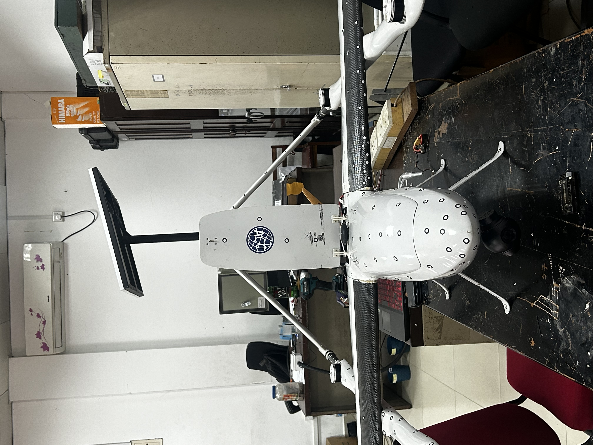

# Babyshark-Vtol-260-progress
This project focuses on the development and testing of a VTOL (Vertical Take-Off and Landing) UAV capable of transitioning between hover mode and fixed-wing flight.

The system was designed with a strong emphasis on **flight safety and stability during transition**, using multiple sensor inputs to detect and prevent stall conditions.

The platform was based on a Babyshark 260 airframe and implemented during my work with UAV systems using a CUAV V5+ flight controller.

---

## ⚙️ Key Features
- VTOL hover-to-fixed-wing transition capability  
- Multi-sensor redundancy for safe transition  
- GPS-assisted navigation and flight stabilization  
- Real-time telemetry using 900 MHz communication  
- SBUS-based high-speed digital receiver input
- Average endurance of 15 mins in hover mode
- Average endurance of 1 hour and 45 mins on fixed wing mode 

---

## 🔌 Hardware Configuration
- Flight Controller: CUAV V5+ (PX4 firmware)  
- Lift Motors: Low KV high-thrust motors (for vertical takeoff)  
- Pusher Motor: 150 KV rear motor (fixed-wing propulsion)  
- Servos: 16g metal gear servos (SPMSA320B)  
  - Ailerons (2)  
  - Elevons (2)  
- Battery: LiPo  
- Telemetry: 900 MHz system  
- RC Control: 2.4 GHz transmitter  

---

## 🧠 Sensor System & Redundancy Design

To ensure safe transition from hover to forward flight, multiple sensors were used instead of relying on a single source:

- Airspeed sensor (primary but unstable in some conditions)  
- GPS (ground speed estimation)  
- IMU (pitch and roll monitoring)  
- Barometer (altitude tracking)  

### 🔑 Key Concept:
The system does **not rely solely on airspeed**, but cross-checks multiple sensor inputs to detect:

- Stall conditions  
- Loss of lift  
- Unstable flight angles  

This redundancy ensures that even if one sensor fails or gives noisy data, the system can still maintain safe operation.

---

## 🧪 Control Strategy

- Minimum satellite requirement set to **8 satellites** for safe GPS operation  
- Transition decision based on:
  - Airspeed threshold  
  - Pitch stability  
  - Altitude consistency  
  - GPS speed validation  

- Flight modes used:
  - Position Hold  
  - Altitude Hold  
  - Stabilized (limited use)  

---

## 🚀 Outcome

- Successfully achieved stable hover in VTOL configuration  
- Validated multi-sensor monitoring approach for transition safety  
- Demonstrated reliable telemetry and control system integration  

⚠️ Transition to fixed-wing mode was not completed due to limited testing time and safety considerations.

---

## ⚠️ Engineering Challenges

- Airspeed sensor instability required alternative validation methods  
- Complex coordination between multiple sensors  
- High thrust requirement during vertical takeoff  
- Limited flight testing opportunities for transition phase  
- Need for precise tuning of transition conditions  

---

## 🔧 Improvements & Future Work
- Complete hover-to-fixed-wing transition testing  
- Implement advanced sensor fusion (e.g., Kalman/Madgwick)  
- Integrate failsafe logic for automatic transition abort  
- Add thermal camera integration for payload missions  
- Improve transition tuning and control logic  

---

## 🏁 Conclusion
This project provided deep insight into VTOL system design, particularly the importance of **sensor redundancy and safe transition logic** in complex UAV systems.
